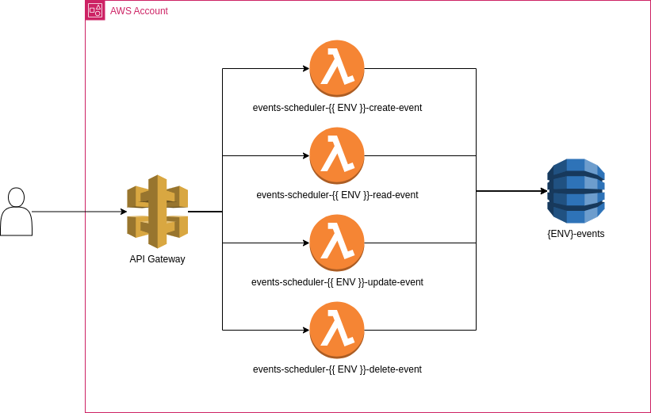

# Events scheduler

A simple CRUD for events

```json
{
   "startDateTime":"2024-08-17T08:30:00.000Z",
   "title":"morning 17",
   "description":"morning 17",
   "endDateTime":"2024-08-17T09:00:00.000Z"
}
```

## Architecture

AWS Api Gateway -> AWS Lambda -> Amazon DynamoDB



## DynamoDB partition key

- I have chosen 'user_id' as the hash key because all queries will be user-level.
- We have chosen 'start_date' as the sort key because all queries will be based on the start date.
